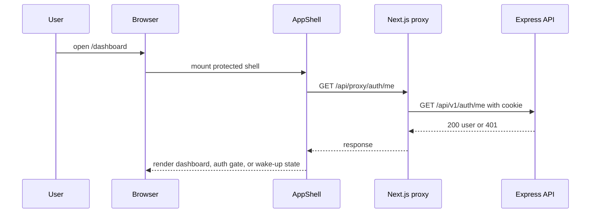
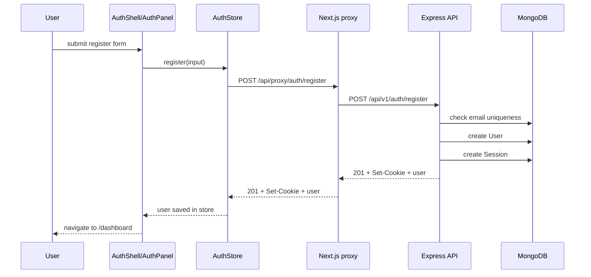
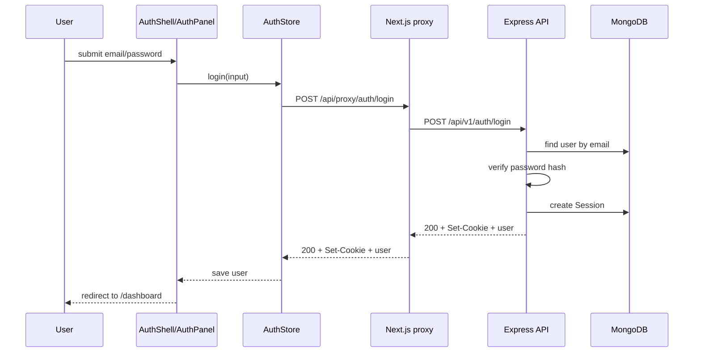
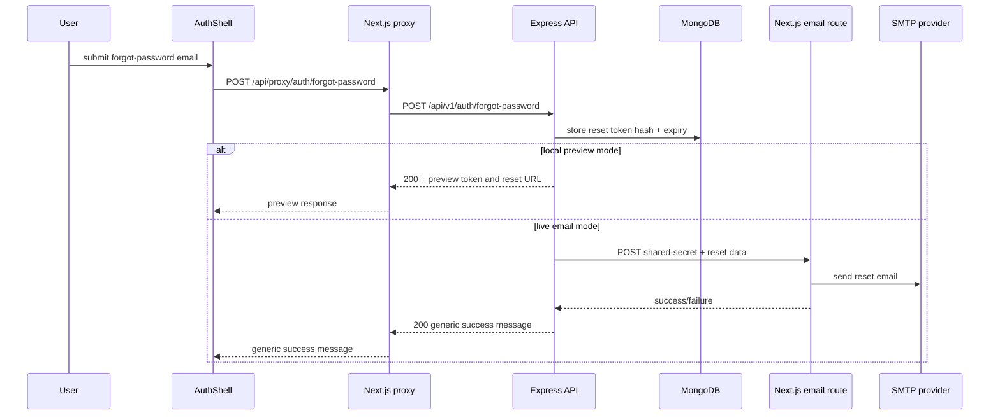
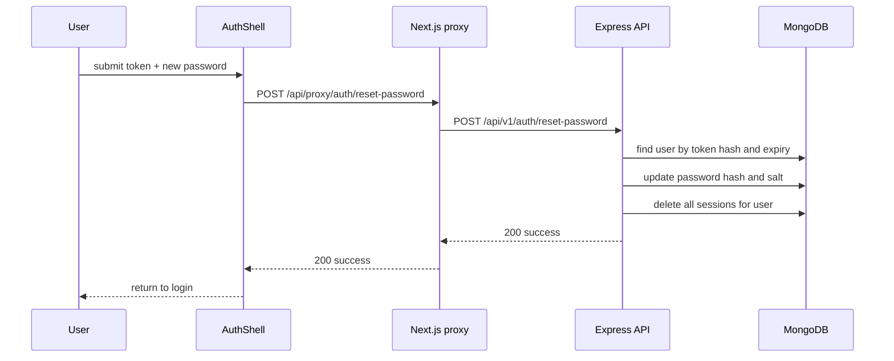
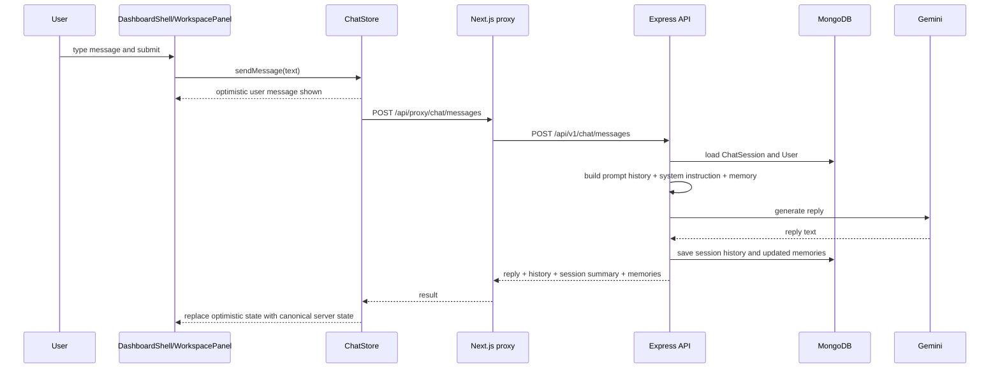
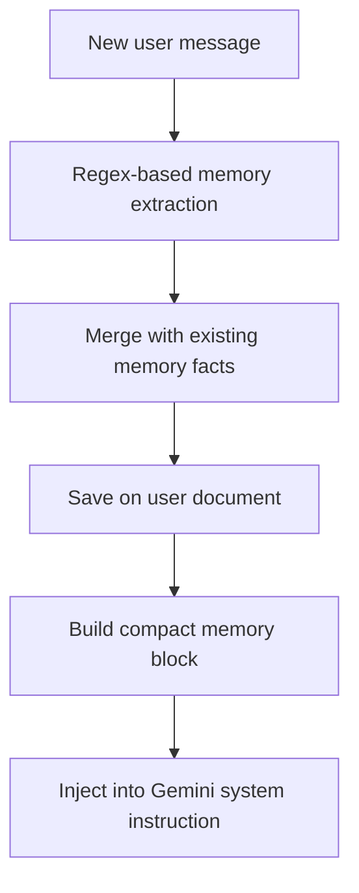
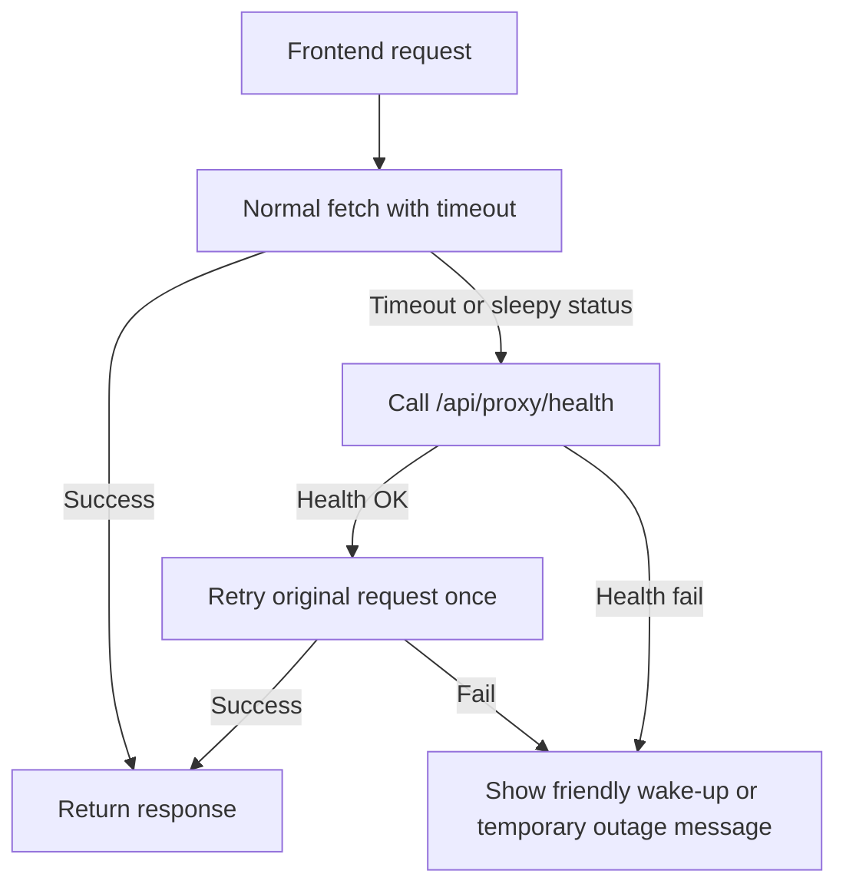

# Workflows and Sequence Diagrams

## Purpose of this document

This document explains the main runtime workflows in Lovique using step-by-step descriptions, diagrams, and concrete examples.

Use it when you want to understand:

- what happens after a user clicks a button
- how frontend and backend coordinate
- where data is stored
- where failures can happen

## 1. App boot and session hydration

Use case:

- a user opens `/dashboard` or `/settings`
- the app needs to determine whether they are still signed in



### Logic summary

1. `AppShell` mounts for protected routes.
2. It calls `authStore.loadCurrentUser()`.
3. The frontend API client calls `/api/proxy/auth/me`.
4. The proxy forwards the cookie to the backend.
5. The backend checks the session through `requireAuth`.
6. If valid, the user is returned.
7. If invalid, the frontend renders the auth-required state.
8. If the backend is sleeping or unavailable, the wake-up state is shown.

### Important files

- `frontend/components/app-shell.tsx`
- `frontend/stores/auth-store.ts`
- `frontend/lib/api.ts`
- `server/src/middleware/auth.middleware.ts`
- `server/src/modules/auth/auth.service.ts`

### Common failure points

- cookie missing
- proxy target misconfigured
- backend asleep
- session expired and cookie cleared

## 2. Registration flow

Use case:

- a new user creates an account from `/auth?mode=register`



### Validation rules that matter

- `name` must be present and within length bounds
- `email` must be valid
- `password` must be strong enough
- `companionGender` must be allowed
- `companionPersonality` must be allowed
- `isAdultConfirmed` must be `true`

### Example request

```json
{
  "name": "Aman",
  "email": "test@example.com",
  "companionGender": "female",
  "companionPersonality": "sweet",
  "password": "Hello@123",
  "isAdultConfirmed": true
}
```

### Example success response

```json
{
  "success": true,
  "message": "Account created successfully.",
  "data": {
    "user": {
      "id": "user-id",
      "name": "Aman",
      "email": "test@example.com",
      "companionGender": "female",
      "companionPersonality": "sweet",
      "createdAt": "2026-04-08T00:00:00.000Z",
      "updatedAt": "2026-04-08T00:00:00.000Z",
      "lastLoginAt": "2026-04-08T00:00:00.000Z"
    }
  }
}
```

### Important files

- `frontend/components/auth-shell.tsx`
- `frontend/components/auth-panel.tsx`
- `frontend/stores/auth-store.ts`
- `server/src/modules/auth/auth.validation.ts`
- `server/src/modules/auth/auth.controller.ts`
- `server/src/modules/auth/auth.service.ts`

## 3. Login flow

Use case:

- a returning user signs in



### Important edge cases

- wrong password returns `401`
- missing session cookie persistence will lead to later `401` on `/auth/me`
- cross-host cookie problems are reduced by the proxy but still depend on correct env and headers

## 4. Forgot password and reset password flow

There are two runtime variants:

- local preview flow for development
- live email flow for deployed environments



### Local preview mode

Preview mode is only enabled when:

- `NODE_ENV=development`
- `APP_URL` points to localhost or `127.0.0.1`

This is useful because it allows local testing without real email delivery.

### Live mode

In live mode:

1. backend creates token and expiry
2. backend builds reset URL for `/auth?mode=reset&token=...`
3. backend calls the frontend email route with a shared secret
4. frontend email route sends the email using SMTP

### Reset completion flow



### Important edge cases

- missing SMTP env returns `503` from the email route
- invalid or expired reset token returns `400`
- production should not expose local preview values

## 5. Chat message flow

Use case:

- an authenticated user sends a message in the dashboard



### What the backend actually does

1. Load or create a `ChatSession`.
2. Load the current `User`.
3. Extract potential memory updates from the new message.
4. Build:
   - compact long-term memory block
   - compact conversation memory block
   - trimmed prompt history
   - system instruction based on personality and companion gender
5. Call Gemini.
6. Save user message and model reply.
7. Save updated memory if anything changed.
8. Return:
   - reply text
   - canonical history
   - persistent memories
   - session summary

### Example request

```json
{
  "sessionId": "c80f4ff3-f966-410a-bcf5-d49b1a14b30b",
  "message": "Remember that I love chai after work."
}
```

### Example response shape

```json
{
  "success": true,
  "message": "Reply generated successfully.",
  "data": {
    "sessionId": "c80f4ff3-f966-410a-bcf5-d49b1a14b30b",
    "reply": "That sounds like a perfect evening ritual.",
    "history": [
      { "role": "user", "parts": "Remember that I love chai after work." },
      { "role": "model", "parts": "That sounds like a perfect evening ritual." }
    ],
    "persistentMemories": [
      {
        "id": "likes-chai-after-work",
        "fact": "Loves chai after work",
        "createdAt": "2026-04-08T00:00:00.000Z",
        "updatedAt": "2026-04-08T00:00:00.000Z"
      }
    ],
    "session": {
      "sessionId": "c80f4ff3-f966-410a-bcf5-d49b1a14b30b",
      "title": "Remember that I love chai after work",
      "messageCount": 2,
      "lastMessage": "That sounds like a perfect evening ritual.",
      "createdAt": "2026-04-08T00:00:00.000Z",
      "updatedAt": "2026-04-08T00:00:00.000Z"
    }
  }
}
```

### Important edge cases

- Gemini config missing returns a user-friendly `503`
- provider rate limits return `429`
- provider/network issues return a user-friendly temporary-unavailable message
- optimistic UI is rolled back on failure

## 6. Conversation management flow

Use cases:

- load recent sessions
- reopen one session
- rename a session
- delete a session
- start a new session

### Load sessions

1. `AppShell` calls `chatStore.loadSessions()` once a user is available.
2. The backend returns session summaries sorted by `updatedAt`.
3. The left sidebar shows the newest five sessions.

### Open a session

1. User clicks a session in the sidebar.
2. `chatStore.openSession(sessionId)` updates the active session ID.
3. `DashboardShell` reacts to session ID change and reloads history.

### Rename a session

1. User clicks the inline rename action.
2. Sidebar enters local edit mode.
3. `chatStore.renameSession()` calls the backend.
4. Returned summary replaces the existing one in store.

### Delete a session

1. User clicks delete.
2. Sidebar shows inline confirmation.
3. `chatStore.deleteSession()` calls the backend.
4. The store removes the session locally.
5. If the deleted session was active, a fresh session ID is generated.

## 7. Memory extraction and reuse flow

Use case:

- a user shares facts that should matter later



### Current memory behavior

- only recognized patterns are saved
- duplicate facts are collapsed
- only a bounded number of facts are stored
- only a bounded number of facts are inserted into prompts

### Good use-case examples

- "Remember that I love chai."
- "My favorite color is green."
- "I live in Jaipur."
- "Call me Aman."
- "I work as a designer."

## 8. Wake-up and retry flow

Use case:

- frontend hits a sleeping or temporarily unavailable backend



### Why this matters

This flow reduces rough edges on hosts that sleep the backend after inactivity.

Instead of showing raw network failures, the UI can say:

- Lovique is waking up
- Lovique needs a moment
- Lovique is temporarily unavailable

### Important files

- `frontend/lib/api.ts`
- `frontend/lib/error-helpers.ts`
- `frontend/stores/toast-store.ts`
- `frontend/components/app-shell.tsx`
- `server/src/app.ts`

## Summary

The most important workflows in Lovique all follow the same pattern:

1. UI component triggers a Zustand action.
2. Zustand action calls the frontend API client.
3. Frontend API client uses the same-origin proxy.
4. Express validates, authenticates, and performs business logic.
5. MongoDB and Gemini are used as needed.
6. The result returns through the proxy.
7. Store state updates drive the UI.

That consistent layering is one of the biggest strengths of the current implementation.
